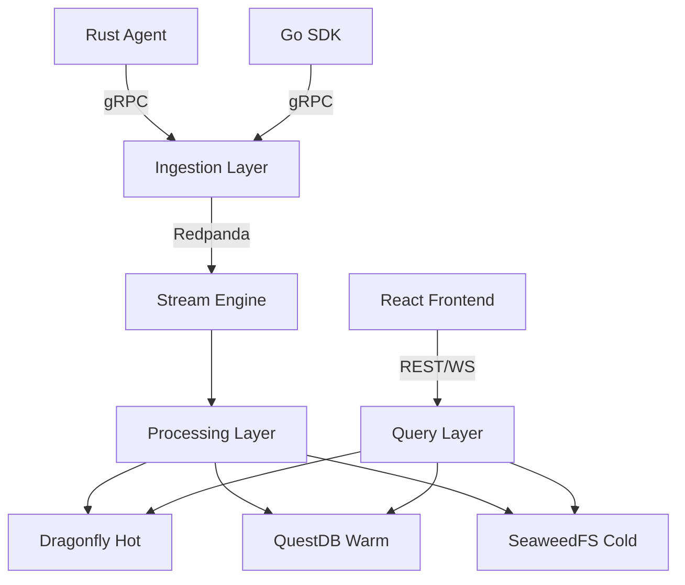
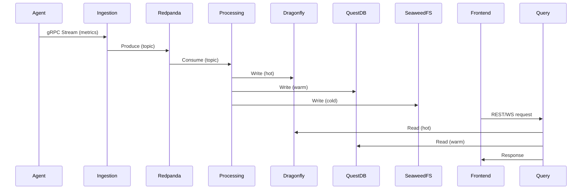

# Generate Architecture Docs — Architecture Documentation

## Purpose
Generate and maintain architecture documentation: component diagrams, deployment diagrams, runbooks, and decision records.

## Execution Steps

### Step 1: Validate Architecture Docs
Check: `docs/architecture/ARCHITECTURE.md` exists and is current
Check: `docs/architecture/ARCHITECTURE_DETAILED.md` exists
Check: `docs/architecture/TECH_STACK.md` exists

### Step 2: Generate Component Diagram
Generate: Mermaid diagram of three-part architecture
Verify: All components listed
Verify: All connections documented

### Step 3: Generate Data Flow Diagram
Generate: Mermaid diagram of metrics flow
Verify: All data paths documented
Verify: Storage tiers shown

### Step 4: Generate Deployment Diagram
Generate: Mermaid diagram of deployment architecture
Verify: All environments documented
Verify: Infrastructure components shown

### Step 5: Generate Runbooks
Check: `docs/deployment/` has runbooks for each service
Check: Runbooks include start/stop/rollback procedures
Check: Runbooks include troubleshooting guides

### Step 6: Generate Decision Records
Check: `docs/architecture/decisions/` has ADRs for key decisions
Check: ADRs include context, decision, and consequences

## Architecture Diagram Templates

### Component Diagram


### Data Flow Diagram


## Runbook Template
```markdown
# Service Name Runbook

## Start
```bash
podman-compose up -d service-name
```

## Stop
```bash
podman-compose down service-name
```

## Rollback
```bash
kubectl rollout undo deployment/service-name
```

## Health Check
```bash
curl http://localhost:8080/healthz
```

## Troubleshooting
| Symptom | Cause | Fix |
|---------|-------|-----|
| Connection refused | Service not running | Start service |
| High latency | Resource exhaustion | Scale up |
```

## Exit Protocol
- ALL docs current: Report "Architecture docs are up to date"
- Outdated diagram: Report which diagram, STOP
- Missing runbook: Report service name, STOP
- Missing ADR: Report decision, STOP

## Notes
- Run after architectural changes
- Diagrams must be in Mermaid format
- Runbooks must be tested
- ADRs are immutable once accepted
